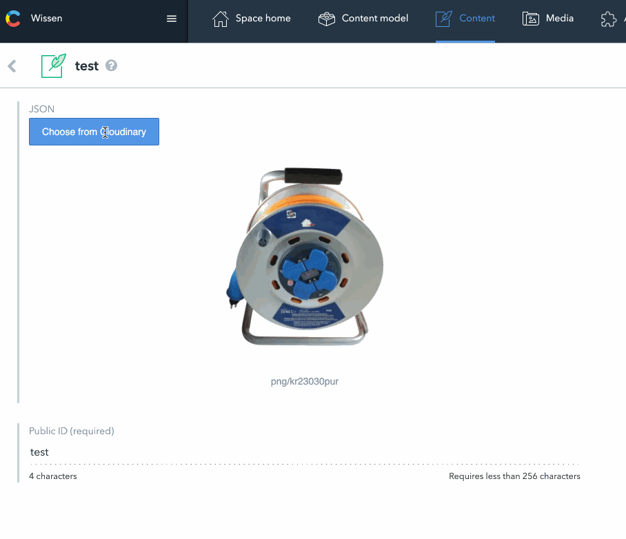

# Contentful meets Cloudinary

This is a Contentful [UI Extension](https://www.contentful.com/developers/docs/concepts/uiextensions/) that integrates Cloudinary’s [Media Library Widget](https://cloudinary.com/documentation/media_library_widget).

## Usage

Not entirely sure yet. I think you need to:

1. `npm run login`
2. `npm run configure`
3. `npm run deploy`
4. In your Contentful settings menu, choose extensions. Open “Cloudinary Media Library” and add your **cloud_name** and **API key**.

Make sure the extension is _self-hosted_. You can use this repository’s Github pages for that: https://github.com/hoelzle/contentful-cloudinary-extension or choose your own setup.
